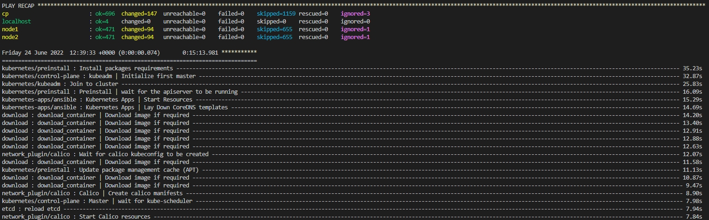
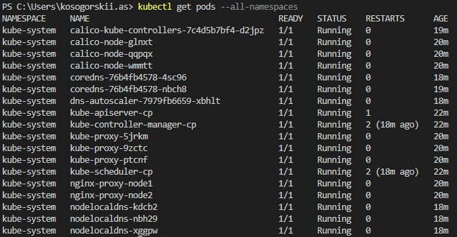

## Конфигурация Kubespray для установки кластера в Yandex Cloud.
Параметры кластера - [inventory.ini](https://github.com/alex-k-7/diplom-kubespray/blob/main/inventory/diplom/inventory.ini).

Для доступа ansible к нодам в файле inventory/diplom/group_vars/all/all.yml добавлен параметр "ansible_user", для которого в локальном профиле среды выполнения ansible-playbook созданы ssh-ключи и публичный передан виртуальным машинам при создании инфраструктуры для кластера.

Для доступа к созданному кластеру извне в файле inventory/diplom/group_vars/k8s_cluster/k8s-cluster.yml изменен параметр "supplementary_addresses_in_ssl_keys" - добавлен внешний адрес control plane ноды. После создания кластера необходимо скопировать файл /etc/kubernetes/admin.conf с контрольной ноды в локальный профиль. 

Установка:
```shell
ansible-playbook -i inventory/diplom/inventory.ini cluster.yml -b -v
```



